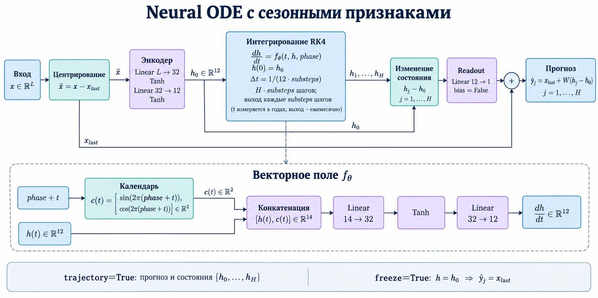

# Лабораторная № 2 Neural ODE для прогнозирования пассажиропотока

## Данные
Классический ряд Box–Jenkins AirPassengers: месячный международный
пассажиропоток в тысячах, январь 1949 — декабрь 1960, 144 наблюдения.
[Документация R](https://stat.ethz.ch/R-manual/R-devel/library/datasets/html/AirPassengers.html),
[CSV](https://raw.githubusercontent.com/vincentarelbundock/Rdatasets/master/csv/datasets/AirPassengers.csv).

## Архитектура

Схема: **24 наблюдения → log-нормализация → центрирование по последнему
наблюдению → encoder 24→32→12 → ODE 12→32→12 → линейное чтение в 12 моментах → exp**.
Последнее наблюдение служит опорным уровнем.

Решатель RK4 с шагом $\Delta=1/12$ года:
$$k_1=f(t,h),\ k_2=f(t+\Delta/2,h+\Delta k_1/2),\
k_3=f(t+\Delta/2,h+\Delta k_2/2),\ k_4=f(t+\Delta,h+\Delta k_3),$$
$$h_{next}=h+\Delta(k_1+2k_2+2k_3+k_4)/6.$$

Обучение: $\mathcal L=\frac1{NH}\sum(\hat z-z)^2$, Adam, lr=0.003,
weight decay=0.0001, полный batch из train-окон, 500 эпох, clip grad norm=1.

[Neural ODE, Chen et al., 2018](https://proceedings.neurips.cc/paper/2018/hash/69386f6bb1dfed68692a24c8686939b9-Abstract.html).

